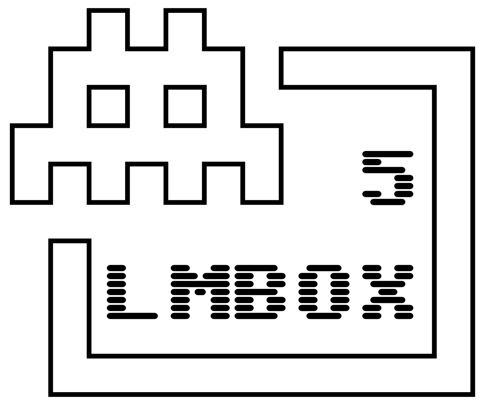
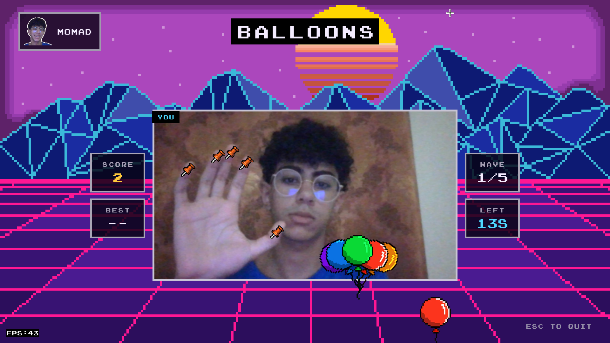
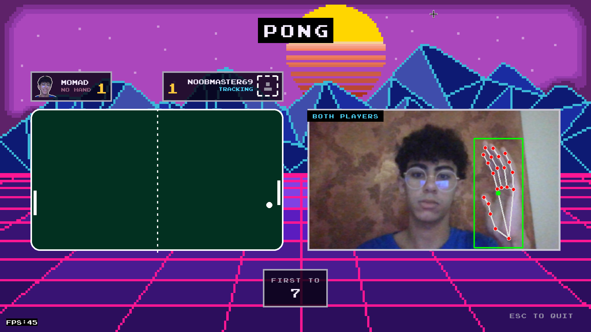
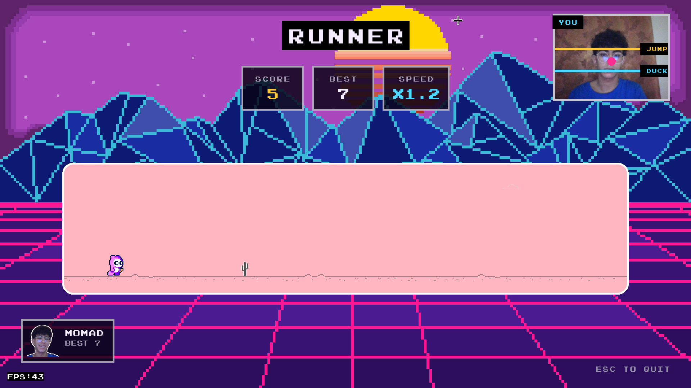
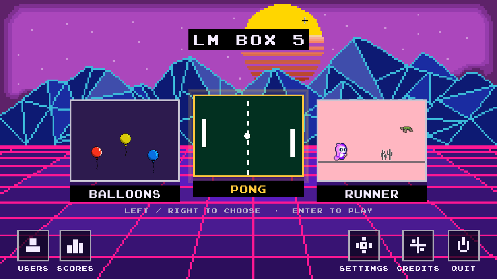
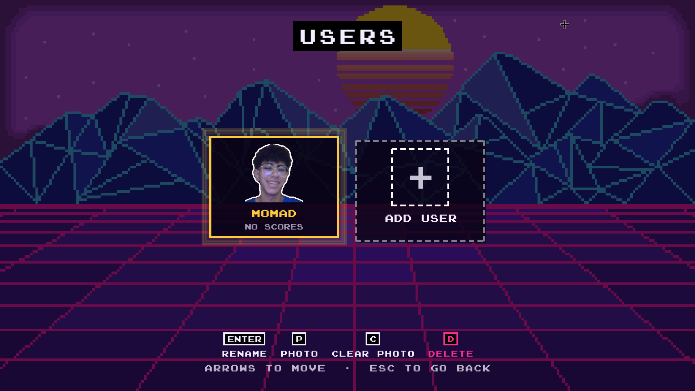
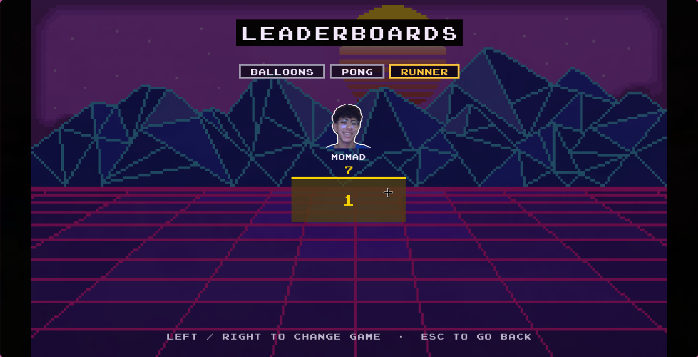
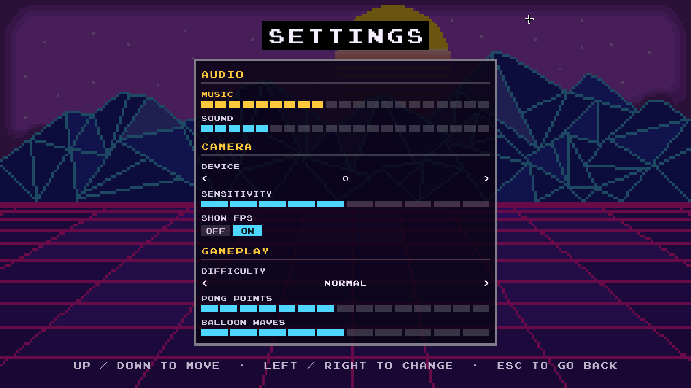

<p align="center">
  
</p>

<h1 align="center">LM Box 5</h1>

<p align="center"><em>Three arcade classics you play with your hands and your body.<br>No controller. No keyboard. Just a webcam and some space to flail in.</em></p>

<p align="center">
  
  
  
  
  
  
</p>

<p align="center">
  <a href="https://momad-y.itch.io/lm-box-5">
    
  </a>
</p>

<!--
itch.io's own embed widget. GitHub strips <iframe> out of README files, so it
will not render here - but it works anywhere that allows raw HTML (a project
site, a blog, a docs page):

<iframe frameborder="0" src="https://itch.io/embed/4984523?linkback=true&amp;bg_color=2C0E5C&amp;fg_color=F4ECFF&amp;link_color=FFC93C&amp;border_color=F4ECFF" width="552" height="167"><a href="https://momad-y.itch.io/lm-box-5">LM Box 5 by Momad-Y</a></iframe>
-->

---

## The games

<table>
<tr>
<td width="33%"></td>
<td width="33%"></td>
<td width="33%"></td>
</tr>
<tr>
<td><strong>🎈 Balloons</strong><br>Pop them before they drift off the top. Your fingertips are the pins.</td>
<td><strong>🏓 Pong</strong><br>Two players, one webcam. Your hand's height is your paddle.</td>
<td><strong>🏃 Runner</strong><br>Stand tall to jump, crouch to duck. You are the runner.</td>
</tr>
</table>

## Everything else

<table>
<tr>
<td width="25%"></td>
<td width="25%"></td>
<td width="25%"></td>
<td width="25%"></td>
</tr>
<tr>
<td align="center"><sub>Menu</sub></td>
<td align="center"><sub>Players</sub></td>
<td align="center"><sub>Leaderboards</sub></td>
<td align="center"><sub>Settings</sub></td>
</tr>
</table>

## Download

Grab a build from **[itch.io](https://momad-y.itch.io/lm-box-5)** or the
**[releases page](https://github.com/Momad-Y/LM-Box-5/releases/latest)**. No Python, no
installer, no account. Download, run, wave at your monitor.

| Platform    | Notes                                                                                               |
| ----------- | --------------------------------------------------------------------------------------------------- |
| **Windows** | Run the `.exe`. SmartScreen may object — _More info_ → _Run anyway_. It is unsigned, not malicious. |
| **macOS**   | Unzip, then **right-click → Open** the first time. Apple Silicon only.                              |
| **Linux**   | `chmod +x` it and go. `./scripts/install_linux_desktop.sh` adds an icon and a launcher entry.       |

## Requirements

**A webcam.** Non-negotiable. All three games are played with hand or body tracking and
there is no keyboard fallback — we removed it deliberately. With no camera, the game will
politely tell you so and then decline to do anything interesting.

Hand and pose tracking (MediaPipe) runs on the CPU every frame, so the CPU is what decides
how smooth this feels. No GPU is required or used. We checked. Twice.

|             | Minimum                   | Recommended                          |
| ----------- | ------------------------- | ------------------------------------ |
| **CPU**     | Dual-core 2.0 GHz (~2015) | Quad-core 3.0 GHz (~2019)            |
| **RAM**     | 4 GB                      | 8 GB                                 |
| **Webcam**  | Any UVC webcam, 480p      | 720p with decent low-light behaviour |
| **Display** | Anything                  | 1920×1080                            |

The games render at up to 60 FPS. How close you get depends almost entirely on MediaPipe
inference speed, which is the single largest cost in every frame — a 2021 mobile i7
measures **38–48 FPS** depending on the game.

## Your camera stays yours

Every frame is processed on your machine. Nothing is uploaded, nothing is recorded, and
the game never asks for an internet connection because it has no use for one. Profiles,
photos and high scores live in a local folder:

| OS      | Location                               |
| ------- | -------------------------------------- |
| Linux   | `~/.local/share/LMBox5`                |
| macOS   | `~/Library/Application Support/LMBox5` |
| Windows | `%LOCALAPPDATA%\LMBox5`                |

Running from source uses the repo's own `data/` instead, so a checkout and an installed
copy never argue over the same files.

## Running from source

```bash
git clone https://github.com/Momad-Y/LM-Box-5.git
cd LM-Box-5
python -m venv .venv
source .venv/bin/activate
pip install -r requirements.txt
python main.py
```

Python **3.10–3.12** (3.11 is what CI uses). Older versions will not resolve the pinned
dependencies, which is a polite way of saying it will not work.

<details>
<summary><strong>Building the executables yourself</strong></summary>

```bash
pip install -r requirements-build.txt
python scripts/build_executable.py        # builds for whichever OS you are on
```

PyInstaller does not cross-compile, but that only forces a separate _machine_ for macOS:

- **Windows from Linux** — `./scripts/build_windows_in_docker.sh` runs a real Windows
  Python under Wine in a container. Genuinely produces a `PE32+` executable.
- **macOS** — needs Apple hardware. The `macos-14` job in
  [the release workflow](.github/workflows/build-executables.yml) rents one for free on
  every `v*` tag, which is cheaper than buying a Mac.

See [`bin/README.md`](bin/README.md) for the long version, including why a 295 MB binary
cannot live in a git repository.

</details>

<details>
<summary><strong>Tests</strong></summary>

```bash
pytest
```

239 of them, and they mostly exist because of things that already went wrong once: a
camera that was never released and froze an entire laptop, a frame-rate cap that was
secretly 62.5, a screen that crashed the moment anyone opened it, and an audio device that
did not exist. Tested by us, repeatedly, at 2 AM.

</details>

## How it works

Two MediaPipe models do the heavy lifting.

<table>
<tr>
<td width="50%"></td>
<td width="50%"></td>
</tr>
<tr>
<td><strong>Hands</strong> — 21 3D landmarks per hand, which become fingertips in Balloons
and paddle height in Pong.</td>
<td><strong>Pose</strong> — 33 body landmarks, which become jumping and ducking in Runner,
calibrated to wherever you were sitting during the countdown.</td>
</tr>
</table>

## Repositories

|               |                                                                                  |
| ------------- | -------------------------------------------------------------------------------- |
| **This repo** | The current game — [`Momad-Y/LM-Box-5`](https://github.com/Momad-Y/LM-Box-5)     |
| **Beta repo** | Where it grew up — [`Samspei01/LM_BOX_5`](https://github.com/Samspei01/LM_BOX_5) |

## The two of us

|              | Mohamed Abdelnasser                                                       | Abdelrhman Saeed                                                           |
| ------------ | ------------------------------------------------------------------------- | -------------------------------------------------------------------------- |
| **Email**    | [mohamed.y.abdelnasser@gmail.com](mailto:mohamed.y.abdelnasser@gmail.com) | [abdosaaed749@gmail.com](mailto:abdosaaed749@gmail.com)                    |
| **GitHub**   | [@Momad-Y](https://github.com/Momad-Y)                                    | [@Samspei01](https://github.com/Samspei01)                                 |
| **LinkedIn** | [Profile](https://www.linkedin.com/in/mohamed-y-abdelnasser)              | [Profile](https://www.linkedin.com/in/abdelrhman-saeed-elsayed-9b17b9238/) |

Production: two guys and a GitHub repo.

## Built with

Pygame · OpenCV · MediaPipe · CVZone · SQLite · spite

Art style: mostly rectangles. 3D models: none, we could not afford the polygons.

## License

MIT — see [LICENSE](LICENSE). Do what you like with it.

<p align="center"><sub>Totally not a dinosaur game anymore.</sub></p>
