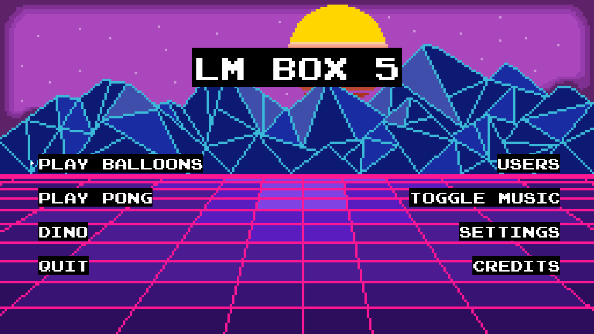
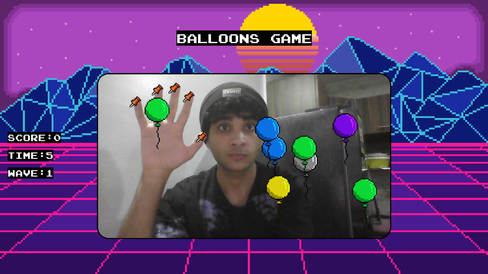
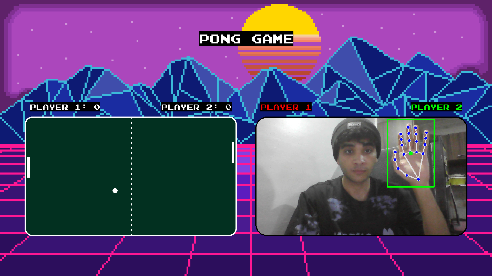
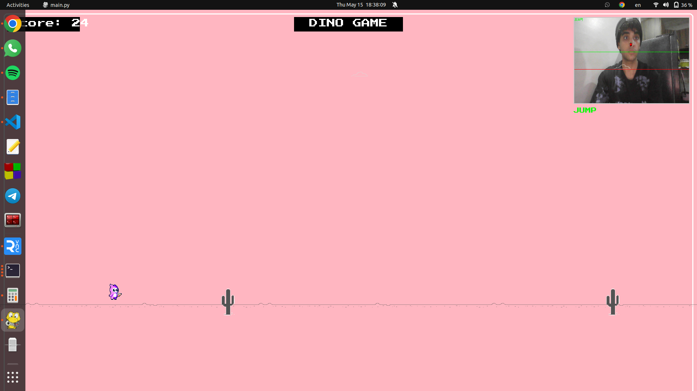

# LM Box 5

## Classic Games Powered by Computer Vision

### Overview

LM Box 5 is a retro gaming project that replaces traditional controllers with computer vision. Players can compete in three classic games:

- **Balloons**: Use finger movements to pop balloons before they vanish.
- **Pong**: Control paddles via hand tracking to bounce a ball back and forth.
- **Runner**: Jump and duck using body movements to avoid obstacles.

The project leverages real-time hand and body tracking using computer vision modules for an intuitive gaming experience.

## Features

- **Hand Tracking**: Utilizes the Mediapipe Hands module for accurate finger detection and gesture recognition.
- **Body Pose Detection**: Uses Mediapipe Pose to track body movements for jumping and ducking.
- **Interactive UI**: A sleek interface for game selection and settings.
- **Real-Time Performance**: Ensures responsive gameplay with minimal lag.
- **Customizable Settings**: Adjustable difficulty, sound levels, and display options.

## Games Included

1. **Balloons**: Pop colorful balloons using finger movements before they float away.
2. **Pong**: Classic two-player paddle game controlled by hand tracking.
3. **Runner**: An endless runner controlled by body movements.

## System Requirements

The hand/pose tracking (Mediapipe) runs on the CPU every frame, so the CPU
is what determines how smooth the games feel - no GPU is required or used.
Figures below are informed by profiling the tracking pipeline directly
(see `docs/PERFORMANCE_AUDIT.md`), not lab-tested across a hardware matrix.

### Minimum

- **OS**: Windows 10, macOS 11, or a modern Linux distro
- **Python**: 3.8 or later (only if running from source)
- **CPU**: dual-core, 2.0 GHz or better (roughly 2015 or newer)
- **RAM**: 4 GB
- **Webcam**: any UVC-compatible webcam, 480p or better - required for
  **Balloons** and **Pong**, both played entirely with hand tracking.
  **Runner** works without one too - it falls back to the keyboard
  (Up/Space to jump, Down to duck) if no camera is found.
- **Storage**: ~1.5 GB free, for the Python environment and dependencies

### Recommended

- **CPU**: quad-core, 3.0 GHz or better (roughly 2019 or newer) - keeps
  tracking comfortably inside the game's 30 FPS frame budget even in busy
  scenes
- **RAM**: 8 GB
- **Webcam**: 720p or better with decent low-light performance, for more
  reliable hand/pose detection
- **Display**: 1920x1080 - the games render onto a fixed 1920x1080 canvas
  and scale to fit any window or monitor size, but a smaller display
  letterboxes it down

## Installation

### Prerequisites

Ensure you have Python 3.8 or later installed.

### Setup

1. Clone the repository (GitHub):
    ```sh
    git clone https://github.com/Samspei01/LM_BOX_5.git
    cd LM_BOX_5
    ```
2. Install dependencies:
    ```sh
    pip install -r requirements.txt
    ```
3. Run the application:
    ```sh
    python main.py
    ```

## Dependencies

Key libraries used in this project:

```
- OpenCV (opencv-python)
- NumPy
- PyGame
- PyGame_menu
- cvzone
- Mediapipe
- SQLite3
```

For the full list, see [requirements.txt](requirements.txt).

## Methodology

LM Box 5 uses the following computer vision technologies:

1. **Mediapipe Hands** module: A high-fidelity hand and finger tracking solution that employs machine learning to infer 21 3D landmarks of a hand from just a single frame. This powers the Balloons and Pong games.

2. **Mediapipe Pose** module: Used in the Runner game to track body position and movements, enabling jump and duck controls.

### How It Works

1. **Mediapipe Hands**:
    - **Hand Detection**: Identifies hands in real-time video streams.
    - **Landmark Inference**: Infers 21 3D landmarks per hand, including finger tips, joints, and palm points.
    - **Gesture Mapping**: Translates finger positions and gestures into game controls.


2. **Mediapipe Pose**:
    - **Pose Estimation**: Tracks full-body movements from RGB video in real time.
    - **Landmark Inference**: Extracts 33 high-fidelity 3D body landmarks and a background segmentation mask.
    - **ML Pipeline**: Uses a two-step detector–tracker approach:
        - **Detector** finds the person/pose ROI.
        - **Tracker** predicts landmarks and segmentation from cropped frames. Detection re-runs only if tracking fails.


### Application in LM Box 5:

- In **Balloons**, finger movements are tracked to pop on-screen balloons.
- In **Pong**, hand gestures control players' paddle movement.
- In **Runner**, body pose detection enables jumping and ducking movements.

## Screenshots

Here are some screenshots showcasing the different games and features of LM Box 5:

- _Main menu interface with game selection options_
  

- _Balloons game with colorful balloons to pop using hand gestures_
  

- _Classic Pong game controlled via hand tracking_
  

- _Runner game with pose detection controls_
  

## References

- [PyGame Documentation](https://www.pygame.org/docs/)
- [Mediapipe Hands Documentation](https://mediapipe.readthedocs.io/en/latest/solutions/hands.html)
- [Mediapipe Pose Documentation](https://mediapipe.readthedocs.io/en/latest/solutions/pose.html)
- [cvzone Repository](https://github.com/cvzone/cvzone)

## Contact

For questions or support, you can reach out to the project maintainers:

| Name            | Abdelrhman Saeed                                                                    | Mohamed Abdelnasser                                                       |
| --------------- | ----------------------------------------------------------------------------------- | ------------------------------------------------------------------------- |
| Email           | [abdosaaed749@gmail.com](mailto:abdosaaed749@gmail.com)                             | [Mohamed.y.abdelnasser@gmail.com](mailto:Mohamed.y.abdelnasser@gmail.com) |
| Code Repository | [GitHub Profile](https://github.com/Samspei01)                                      | [Github Profile](https://github.com/Momad-Y)                              |
| LinkedIn        | [LinkedIn Profile](https://www.linkedin.com/in/abdelrhman-saeed-elsayed-9b17b9238/) | [LinkedIn Profile](https://www.linkedin.com/in/mohamed-y-abdelnasser)     |

## Credits

- Built with Pygame and Mediapipe
- Font: Press Start 2P, Joystix Monospace
- Sound effects: Creative Commons licensed

## License

This project is licensed under the MIT License.

## Contributing

Contributions are welcome! Please feel free to submit a Pull Request.
